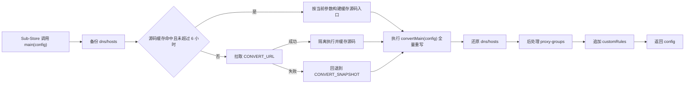

# Sub-Store 三合一合并脚本 · substore-combined.js

[](https://github.com/sub-store-org/Sub-Store)
[](https://github.com/MetaCubeX/mihomo)
[](./substore-combined.js)
[](#-许可)

> **远程优先、快照兜底版**三合一覆写脚本，执行流程等价于 `0.js → convert.min.js#grouptype=1 → 1.js`，开箱即用。

---

## 📌 简介

`substore-combined.js` 是为 [Sub-Store](https://github.com/sub-store-org/Sub-Store) 定制的 Clash / Mihomo 配置覆写脚本，整合三段逻辑于一体：

1. **0.js** — 备份原始 `dns` / `hosts`
2. **convert.min.js**（[powerfullz/override-rules](https://github.com/powerfullz/override-rules)）— 全量重写：节点分组、规则集、DNS、嗅探等
3. **1.js** — 还原 DNS / Hosts + 追加自定义后处理与分流规则

与传统三段式引用不同，本脚本会优先在运行时获取 CDN 上的 `convert.min.js`；下载、编译或运行失败时，回退到文件尾部的内联快照 `CONVERT_SNAPSHOT`。

> 当前仓库包含可直接部署的 `substore-combined.js` 以及零依赖回归测试；部署脚本的修改直接落在该文件中。

### 版本与回退

- **远程来源**：`cdn.jsdelivr.net/gh/powerfullz/override-rules/convert.min.js`，源码缓存有效期为 6 小时。
- **内联回退**：`CONVERT_SNAPSHOT` 是仓库内置的历史快照，标记日期为 `2026-08-26`；它用于远程不可用时保持脚本可运行，不保证与当前 CDN 内容一致。
- **审查时对比**：远程源码约 `21,595` 字节，内联快照约 `19,261` 字节，内容并不相同。因此本项目是“运行时优先使用远程版本”，而不是“仓库内嵌始终是最新版”。
- **快照维护**：当前仓库没有自动构建快照的脚本；需要更新内联快照时，需要从指定远程版本重新生成并复核。

---

## ✨ 特性

| 特性 | 说明 |
|------|------|
| 🔄 远程优先 | 运行时从 `cdn.jsdelivr.net/gh/powerfullz/override-rules/convert.min.js` 获取当前可用源码，6 h 本地内存缓存源码，避免每次生成配置都触发网络请求；缓存不会绑定首次调用参数 |
| 🛡️ 兜底快照 | 远程拉取、编译或运行失败时回退到文件尾部的 `CONVERT_SNAPSHOT` 历史快照（快照日期：2026-08-26）；HTTP 两条路径均有 15 s 硬超时 |
| 🔒 入口隔离 | 通过 `new Function` 和独立 `globalThis` 取出上游 `main`，防止其覆盖本脚本入口；这不是安全沙箱 |
| 💾 DNS / Hosts 保护 | 执行前后完整备份 / 还原用户原始 `dns` 与 `hosts`，中间脚本的重写不会污染自定义 DNS |
| 🎯 精细后处理 | 剔除「选择代理」中的「自动选择」、删除「非香港节点」组、「AI服务」摘除「选择代理/香港节点」并转故障转移、「谷歌服务」前插「AI服务」、「javdb」地区手动选择组 |
| 📏 幂等规则插入 | 自定义分流规则去重插入，重复生成不堆积（`customRules + oldRules.filter`） |

---

## 📂 文件结构

```
.
├── .gitignore                   # 忽略依赖、日志和临时文件
├── README.md                    # 本文档
├── package.json                 # 零依赖测试入口
├── substore-combined.js         # Sub-Store 中直接引用（Snapshot 2026-08-26）
└── test/
    └── substore-combined.test.js # 缓存、超时、回退、DNS/Hosts 与幂等回归测试
```

---

## ⚙️ 工作原理



### 关键实现

- **缓存键**：`globalThis.__SUBSTORE_COMBINED_CONVERT_V2__ = { code, time }`，TTL = `6 * 60 * 60 * 1000`；缓存源码而非已绑定 `$arguments` 的函数
- **下载**：优先 `fetch`（Node 18+ Sub-Store 后端自带），降级 `$substore.http.get`；两条路径均有 15 s 硬超时，脚本大小上限 2 MiB
- **隔离执行**：`new Function("globalThis","$arguments", code + ";return globalThis.main;")({}, args)`
- **参数透传**：Sub-Store URL 上的 `#` 参数优先于默认值，见下表

---

## 🎛️ 支持参数（URL Hash）

在 Sub-Store 脚本引用 URL 后追加 `#key=value&...` 即可覆盖默认值。例：

```
https://cdn.jsdelivr.net/gh/<user>/<repo>/main/substore-combined.js#grouptype=2&threshold=5&regex=true
```

| 参数 | 类型 | 默认 | 说明 |
|------|------|------|------|
| `grouptype` | `0 / 1 / 2` | `1` | 地区分组类型：`0` = select 手动选择、`1` = url-test 自动测速、`2` = load-balance 负载均衡。兼容旧参 `loadbalance=true→2 / false→1` |
| `ipv6` | boolean | `false` | 启用 IPv6 |
| `tun` | boolean | `false` | 启用 TUN（gVisor + route-exclude + dns-hijack） |
| `full` | boolean | `false` | 输出完整 Mihomo 配置（含 mixed-port、external-controller 等，适合纯内核启动） |
| `keepalive` | boolean | `false` | 启用 `tcp-keep-alive` |
| `fakeip` | boolean | `true` | DNS 使用 FakeIP；`false` 时为 RedirHost |
| `quic` | boolean | `false` | 放行 QUIC（UDP 443） |
| `threshold` | number | `0` | 地区节点数 < 阈值时不显示该分组 |
| `regex` | boolean | `false` | 正则过滤模式：用 `include-all + filter` 而非枚举节点名写入地区组 |
| `landing` | — | 自动 | 根据节点 `dialer-proxy` 字段自动识别落地节点，无需传参 |

> 上游参数解析入口为 `G(ce())`。

---

## 🔧 后处理逻辑（1.js 部分）

### 1. 清理「选择代理」

```js
// 从「选择代理」中排除「自动选择」，避免与 url-test 组重复调度
g.proxies = g.proxies.filter(p => p !== "自动选择");
```

### 2. 收集地区节点组（动态，不硬编码）

地区组统一命名为 `<国家/地区>节点`（如 `香港节点`、`台湾节点`、`美国节点`），以 `节点` 结尾。
后处理先排除功能组（`自动选择 / 手动选择 / 落地节点 / 低倍率节点 / 前置代理 / 非香港节点 / javdb`），
剩下的即为**每一个地区的节点组**，天然兼容 `grouptype=0/1/2` 与 `threshold` 过滤：

```js
// 模块级常量 + 单次遍历：一次循环同时收集地区组并定位 选择代理/AI服务/谷歌服务
const __EXCLUDED_NODE_GROUPS = new Set(["自动选择", "手动选择", "落地节点", "低倍率节点", "前置代理", "非香港节点", "javdb", "javdb手动选择"]); // 旧名仅升级兼容
const __NODE_SUFFIX = /节点$/;
const regionGroups = [];
for (const g of groups) {
  if (__NODE_SUFFIX.test(g.name) && !__EXCLUDED_NODE_GROUPS.has(g.name)) regionGroups.push(g.name);
}
```

### 3. 已删除「非香港节点」组

不再创建该组；同时清理旧配置中的残留（幂等），并从 `AI服务` 的引用中摘除：

```js
config["proxy-groups"] = config["proxy-groups"].filter(g => g.name !== "非香港节点");
```

### 4. 新增「javdb」手动选择组（包含每一个地区的节点组）

javdb 专用 `select` 组，`proxies = __regionGroups`（**含香港节点在内的全量地区组**，动态取值）：

```js
{ name: "javdb", type: "select", proxies: __regionGroups }
```

同样幂等：已存在则只更新 `proxies`，重复生成不堆积。切换节点时在客户端手动点选即可，无需改规则。

### 5. 注入服务链

- `AI服务`：摘除 `选择代理` / `香港节点` / `非香港节点` 引用，类型由 `select` 改为 `fallback`（`url / interval / tolerance` 缺失时自动补齐）
- `谷歌服务` 组保留原有成员并最前插入 `AI服务`（去重幂等）

### 6. 自定义分流规则（幂等）

```js
const customRules = [
  "DOMAIN,cpa.wisdamsatan.de,DIRECT",
  "DOMAIN-SUFFIX,bingosoft.net,DIRECT",
  "DOMAIN-SUFFIX,opencode.ai,AI服务",               // opencode.ai 走 AI 服务
  "DOMAIN-KEYWORD,javdb,javdb",         // 含 javdb 的域名走 javdb 组（含主站，已覆盖 SUFFIX 场景）
];
const customRuleSet = new Set(customRules); // O(1) 去重，原 includes 版为 O(n*m)
config.rules = customRules.concat(oldRules.filter(r => !customRuleSet.has(r)));
```

> javdb 仅保留 `DOMAIN-KEYWORD,javdb` 一条：KEYWORD 已覆盖主站 `javdb.com`，无需再写 SUFFIX。
> javdb 规则指向 `javdb` 组，组内再手动选择具体地区（香港/台湾/美国/日本…）。

---

## 🚀 在 Sub-Store 中使用

1. Sub-Store → `脚本操作` → 新建脚本，粘贴本文件内容或引用远程 URL
2. 订阅 → `脚本` 列选择本脚本，参数示例：`#grouptype=1&regex=false`
3. 保存并生成订阅，客户端（Clash Verge / Mihomo Party / Stash 等）导入即可

#### 本地引用示例

```
脚本路径: ./substore-combined.js
参数: grouptype=1
```

#### 远程引用示例

```
https://raw.githubusercontent.com/lijianbin2/1/main/substore-combined.js#grouptype=1
https://cdn.jsdelivr.net/gh/lijianbin2/1@main/substore-combined.js#grouptype=1
```

---

## 🧪 本地验证

```bash
npm test
```

测试直接加载部署脚本，覆盖不同 `grouptype` 的缓存隔离、远程运行/返回值异常回退、`fetch` 硬超时、DNS/Hosts 空值保留、后处理幂等以及 `threshold` 默认值。

> 安全提示：自动更新会在 Sub-Store 运行时执行上游远程 JavaScript。这里只解决入口覆盖与失败恢复，不等同于安全沙箱；是否信任 `powerfullz/override-rules` 由使用者决定。

---

## 📝 来源与致谢

- 覆写核心：[powerfullz/override-rules](https://github.com/powerfullz/override-rules) — `convert.min.js`
- 图标 CDN：`cdn.jsdelivr.net/gh/Koolson/Qure`
- 规则数据：`MetaCubeX/meta-rules-dat` (geoip/geosite/mmdb/asn)

---

## 📄 许可

遵循上游 `powerfullz/override-rules` 的开源许可。自定义后处理部分可按需自由使用。

---

*README 重写于 2026-09-13；2026-09-24 完成缓存、超时、异常回退、DNS/Hosts、测试体系与版本说明审查优化 · 内置回退快照 2026-08-26 · 仓库推送 `lijianbin2/1@main`*
